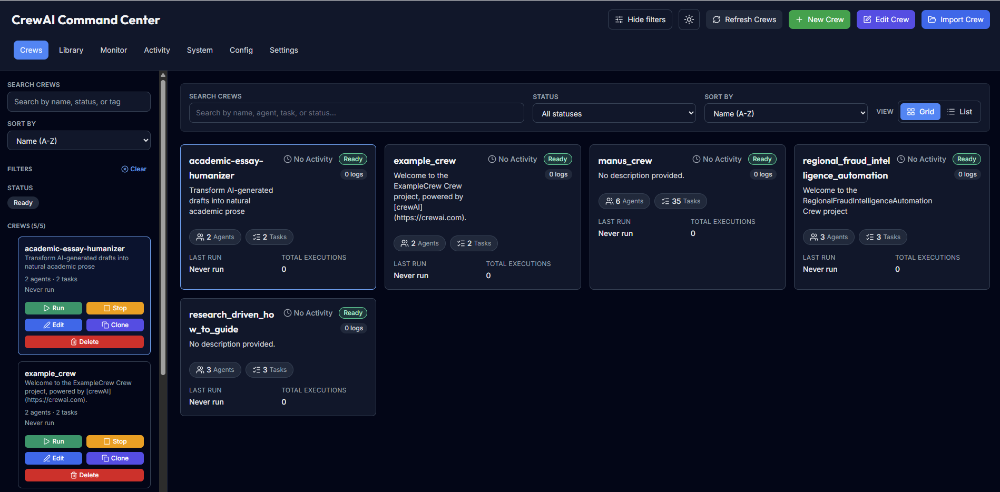

# CrewAI Command Center 🚀

**A comprehensive web-based management dashboard for CrewAI crews with real-time monitoring and control.**

[Features](#-features) • [Quick Start](#-quick-start) • [Deployment](#-deployment) • [Architecture](#-architecture) • [Contributing](#-contributing) • [Troubleshooting](#-troubleshooting--tips) • [Resources](#-resources)

---

## 📋 Overview

CrewAI Command Center is a full-stack web application that provides a centralized dashboard for managing, monitoring, and controlling your CrewAI crews. Built with modern technologies like FastAPI for the backend and React for the frontend, it offers real-time insights into your AI agents' performance and seamless environment management.

### 👩‍💻 Who It's For

- **Beginners exploring CrewAI** who want a guided way to spin up working examples.
- **Developers building custom crews** who need tooling for configuration, monitoring, and orchestration.
- **Operators running production workloads** who value observability and predictable deployments.

### 🎯 Key Benefits

- **Centralized Control**: Manage all your CrewAI crews from a single dashboard.
- **Real-time Monitoring**: Live updates on crew status, logs, and performance metrics via WebSockets.
- **Environment Management**: Edit and manage `.env` files and crew configurations (YAML/JSON).
- **Modular Crew Integration**: Easily integrate and manage multiple independent CrewAI projects.
- **Responsive Design**: Works seamlessly on desktop and mobile devices.

## ✨ Features

- **Crew operations at a glance** – Start, stop, and monitor crews with intuitive health indicators and live activity feeds.
- **Curated template library** – Bootstrap research, writing, scraping, and summarization workflows from the gallery or REST API.
- **Smart configuration editing** – Browse and edit crew YAML/JSON alongside syntax-highlighted `.env` management tools.
- **Unified observability** – Stream logs in real time, filter incidents, and review timeline insights from the dashboard.
- **Built-in system monitoring** – Track CPU, memory, uptime, and API latency/error metrics without leaving the app.

> Dive deeper into every panel, REST endpoint, and monitoring widget in the [full feature tour](docs/features.md).

## 🚀 Quick Start

Pick Docker for the bundled stack or start services locally when you need more control.

### Common prerequisites
1. `git clone https://github.com/kdkiss/CrewAI-Command-Center.git && cd CrewAI-Command-Center`
2. `cp backend/.env.example backend/.env && cp frontend/.env.example frontend/.env`

### Run with Docker
- `docker compose -f docker-compose.dev.yml up --build`, then open http://localhost:3000 (FastAPI docs: http://localhost:8001/docs).
- Need extra configuration? See [docker-compose.dev.yml](docker-compose.dev.yml) and [docker-setup.md](docker-setup.md).
- On Linux hosts, match the container user to your UID/GID to keep the mounted
  `crews/` directory writable: `APP_UID=$(id -u) APP_GID=$(id -g) docker compose up`.

### Run locally (Python + Node)
- Backend dev server: `cd backend && uvicorn main:app --reload --port 8001 --host 0.0.0.0` (dependency setup lives in [backend/README.md](backend/README.md)).
- Frontend dev server: `cd frontend && npm install && npm run dev` (full workflow in [frontend/README.md](frontend/README.md)).

## 🐳 Deployment

Spin up the entire stack with Docker Compose for either development convenience or production reliability. Review environment variables, override strategies, and step-by-step commands in the dedicated [deployment guide](docs/deployment.md).

## 🏗️ Architecture

The platform separates the React frontend, FastAPI backend, and CrewAI orchestration layers while keeping them synchronized through Socket.IO. Explore the system diagram and component responsibilities in the [architecture overview](docs/architecture.md).

## 🧩 Crew Catalog

Kickstart your experiments with the bundled research, writing, and transformation crews that showcase different CrewAI workflows. See the full breakdown of included templates in the [crew catalog](docs/crew-catalog.md).

## 🛠️ Technology Stack

The dashboard pairs a FastAPI backend with a React frontend and realtime communication powered by Socket.IO. Review the full list of backend and frontend dependencies in the [technology stack reference](docs/tech-stack.md).

## 📚 Resources

- [Deployment guide](docs/deployment.md)
- [Architecture overview](docs/architecture.md)
- [Crew catalog](docs/crew-catalog.md)
- [Technology stack reference](docs/tech-stack.md)

## 🤝 Contributing

We welcome contributions! Please follow standard GitHub flow: fork the repository, create a new branch, make your changes, and submit a pull request.

### 🔁 Dependency setup for local development

The repository relies on its lockfiles (`requirements.txt` for Python and `package-lock.json` for Node.js) so everyone shares reproducible environments. After cloning:

- Create a virtual environment in `backend/` and install dependencies with `pip install -r requirements.txt`.
- If you installed the backend before the dependency cleanup, refresh your environment (`pip install --upgrade --force-reinstall -r requirements.txt` or recreate the virtualenv) so the removed optional packages (`chromadb`, `pypdf`, `tiktoken`) are dropped.
- Install frontend packages from the lockfile inside `frontend/` with `npm install` (or `npm ci` for a clean, lockfile-only install).

Optional, crew-specific Python dependencies are tracked separately—see [docs/crew-optional-dependencies.md](docs/crew-optional-dependencies.md) for details when working with bundled example crews or adding new ones.

Do not commit generated directories such as `frontend/node_modules/` or `.venv/`; they are intentionally ignored via `.gitignore` so each contributor can manage their own local environments. Instead, run `npm install` (or `npm ci`) inside `frontend/` whenever you set up the project or pull dependency updates so your local `node_modules/` tree is recreated without being added to version control.

## 🛟 Troubleshooting & Tips

- **Port already in use?** Stop other processes on ports `3000` (frontend) or `8001` (backend) or change the ports in the `.env` files.
- **Socket.IO connection warnings?** Ensure `REACT_APP_WS_URL` in `frontend/.env` points to the backend host and port that expose WebSocket traffic.
- **Environment variable changes not showing up?** Restart the affected service after editing `.env` files so the new values are loaded.
- **Python dependency issues?** Remove the `.venv` folder (or `conda` environment), recreate it, and reinstall with `pip install -r requirements.txt`.
- **Node packages missing?** Delete `frontend/node_modules` and run `npm install` (or `yarn install`) again.

## 📄 License

This project is licensed under the [MIT License](LICENSE).

## 🆘 Support

- **Issues**: [GitHub Issues](https://github.com/kdkiss/CrewAI-Command-Center/issues)

## 🙏 Acknowledgments

- [CrewAI](https://github.com/joaomdmoura/crewai) - The amazing AI crew framework.
- [FastAPI](https://fastapi.tiangolo.com/) - For the excellent web framework.
- [React](https://reactjs.org/) - For the powerful UI library.
- [Socket.IO](https://socket.io/) - For real-time communication.

---

**Made with ❤️ for the AI community**

[⭐ Star this repo](https://github.com/kdkiss/CrewAI-Command-Center/stargazers) • [🐛 Report bug](https://github.com/kdkiss/CrewAI-Command-Center/issues) • [✨ Request feature](https://github.com/kdkiss/CrewAI-Command-Center/issues)

