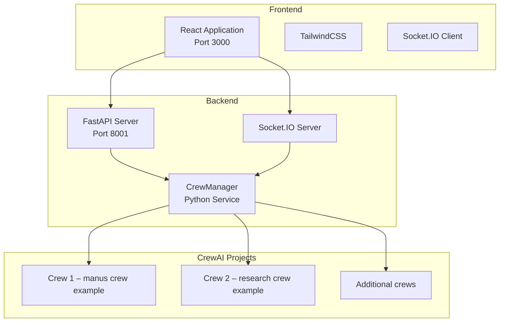

# Architecture Overview

The CrewAI Command Center is a modular system that separates the user interface, API, and crew orchestration layers while maintaining real-time communication between them.

The React frontend communicates with the FastAPI backend and Socket.IO server to deliver real-time crew activity, configuration management, and observability features. The backend orchestrates multiple CrewAI projects through the CrewManager service, allowing additional crews to be plugged into the system as needed.
