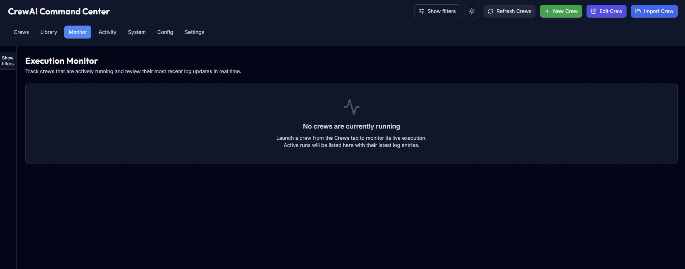

# CrewAI Command Center Feature Tour

## Crew Management
- **Process Control**: Start, stop, and restart crews.
- **Status Monitoring**: Real-time crew status with health indicators.
- **Configuration Editor**: Visual YAML/JSON editor for crew configurations.
- **Crew Creation/Import**: Create new crews or import existing ones from configurations.
- **Template Gallery**: Kick-start new crews with curated agent/task blueprints via the UI or the `/api/crew-templates` API.


*Full-width view of the crew management workspace with run controls, crew metadata, and the execution monitor panel.*

## Template Library
- **Available blueprints**: Research, writing, web scraping, and summarization crews ship out of the box, each pre-configured with agents, tasks, and metadata.
- **Create-flow gallery**: Visiting <kbd>Create Crew</kbd> now opens a template gallery so you can pre-populate the editor with a curated workflow or start from scratch.
- **REST access**: Fetch the catalog or a full definition directly from the backend:

  ```bash
  curl http://localhost:8001/api/crew-templates | jq '.[] | {id, name, agentCount, taskCount}'

  curl http://localhost:8001/api/crew-templates/research | jq
  ```

  The detailed payload matches what `POST /api/crews` expects, so you can tweak agents, tasks, or metadata before saving.
- **Customization**: Use the template as a starting point—rename agents, adjust goals, or add tasks in the editor, then save the crew as normal.

## Environment Management
- **File Browser**: Navigate and manage `.env` files across projects.
- **Smart Editor**: Syntax-highlighted editor for environment variables.


*In-app environment editor focused on the research crew’s `.env` file with autosave and version history controls.*

## Dashboard & Analytics
- **System Overview**: Comprehensive dashboard with key metrics (CPU, Memory, uptime, and service health).
- **Activity Feed**: Real-time activity log with filtering capabilities.
- **Log Streaming**: Live log output from running crews.


*The execution monitor aggregates log events for the selected crew with quick filters and export options.*

### Activity Tab
Head to the **Activity** navigation tab to review a chronological feed of lifecycle changes, highlighted log entries, and system broadcasts. Toggle between lifecycle, log, alert, or system views with the filter buttons and narrow the results down to a single crew when you are triaging an incident.

## Real-time Features
- **WebSocket Integration**: Instant updates without page refresh.
- **Live Log Streaming**: Real-time log output from running crews.
- **Status Updates**: Immediate notification of crew state changes.
- **Resource Monitoring**: Live charts of system resource usage.

## System Monitoring Panel
The home view surfaces a dedicated system monitoring panel that keeps critical infrastructure metrics front and center.


*System monitoring dashboard summarizing CPU, memory, uptime, and request metrics at a glance.*

### Highlights
- **Instant insight** into CPU, memory, uptime, and backend service health through card-based visualizations.
- **Automatic polling** of the `/api/system/stats` endpoint with graceful error handling and manual refresh controls.
- **Real-time push updates** when Socket.IO is available, falling back to REST polling if the connection is unavailable.
- **Request telemetry** summarizing rolling FastAPI latency and error-rate metrics so incidents can be spotted before alerts fire.

### Latency & Error Metrics
The backend wraps FastAPI in lightweight middleware that records each `/api` request's duration and status code. Metrics are aggregated over a rolling observation window (5 minutes by default, configurable via `REQUEST_METRICS_WINDOW_SECONDS`) and are surfaced in both the REST endpoint and the `system_stats` Socket.IO broadcast.

The `/api/system/stats` payload includes two objects:

- `latency`
  - `averageMs` — Mean response time in milliseconds across the sampled window.
  - `p95Ms` — The 95th percentile latency for the same period.
  - `sampleSize` — Number of requests observed in the window.
  - `windowSeconds` — Duration, in seconds, of the rolling window that produced these values.
- `errorRate`
  - `ratio` — Fraction of sampled requests that returned a 4xx or 5xx status.
  - `errors` / `requests` — Raw counts backing the ratio.
  - `windowSeconds` — The window used for the aggregation (mirrors the latency value).

These statistics are intended to give operations teams quick visibility into API health trends from the System Monitor panel. Pair them with your existing alerting to confirm whether an incident is localized or systemic.

> 💡 Configure `REACT_APP_API_BASE_URL` to point REST requests at a remote API (defaults to `/api`) and `REACT_APP_WS_URL` to target a Socket.IO endpoint (defaults to the same origin). The monitoring panel will adapt automatically to the configured endpoints.
